# luci-app-bootstrap-colorful
Inspired by [reddit@needefsfolder](https://www.reddit.com/user/needefsfolder/):  
https://www.reddit.com/r/openwrt/comments/qmtmpf/lucithemebootstrap_some_modifications_using/ and added several color scheme styles.

## BootstrapDarkBlue
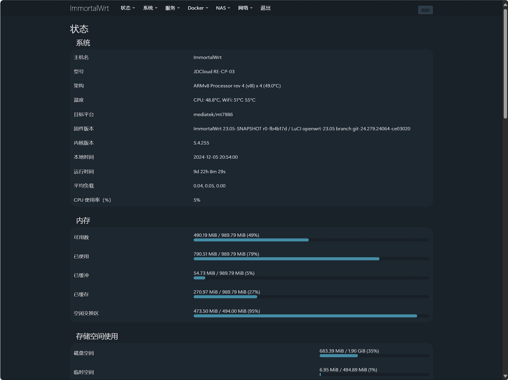
## BootstrapLightBlue
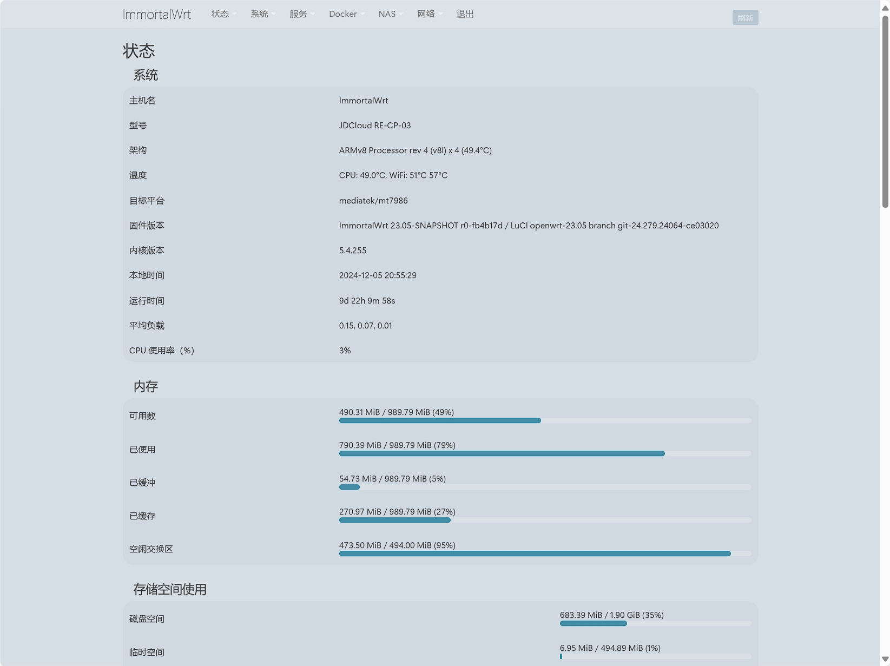
## BootstrapDarkRed
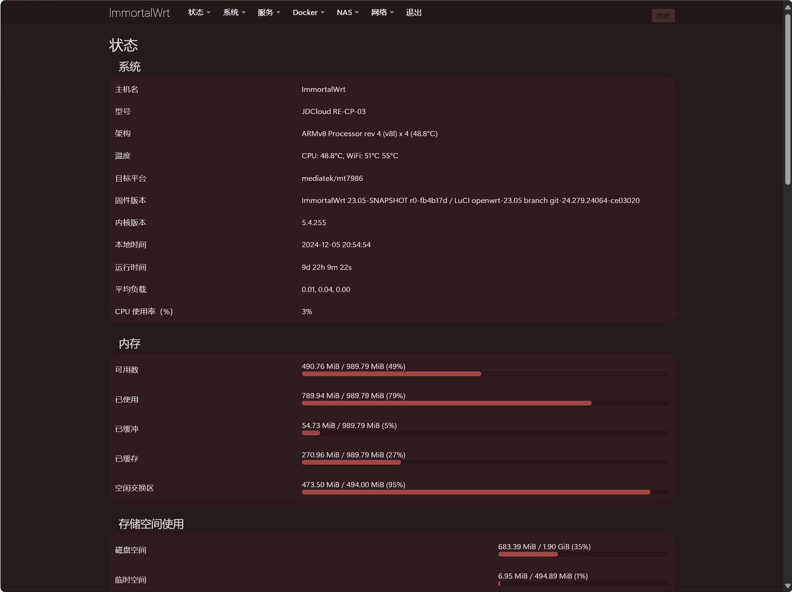
## BootstrapLightRed
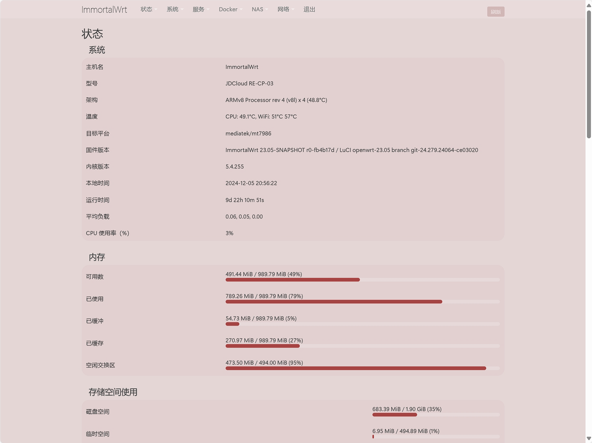
## BootstrapDarkGreen
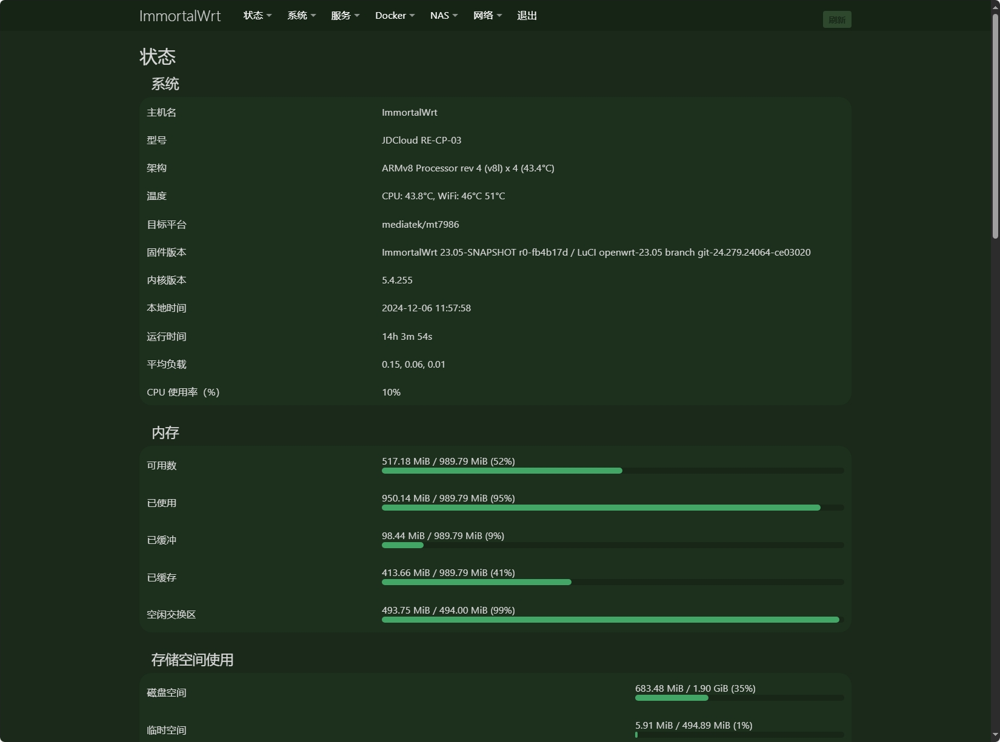
## BootstrapLightGreen
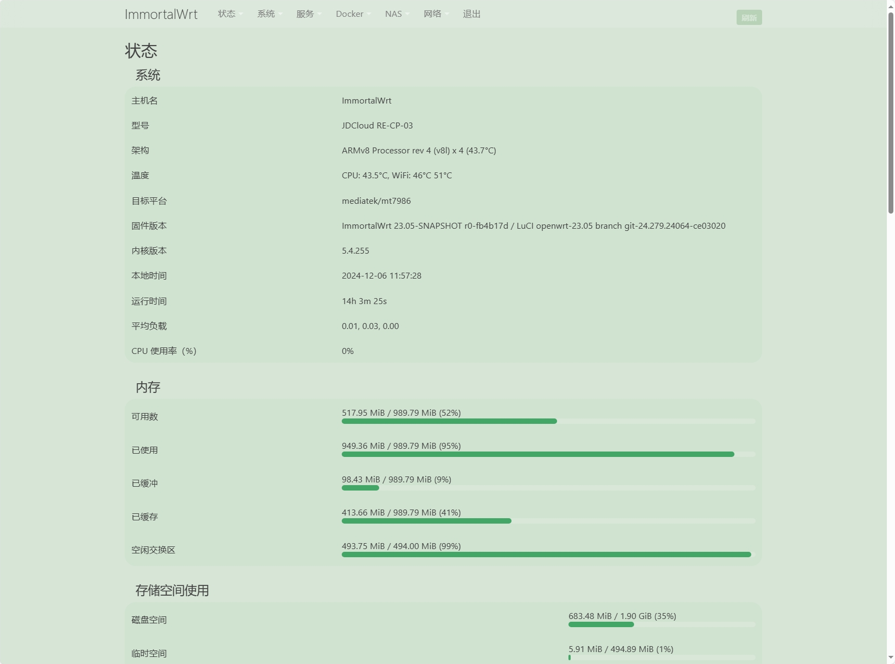
## BootstrapDarkYellow
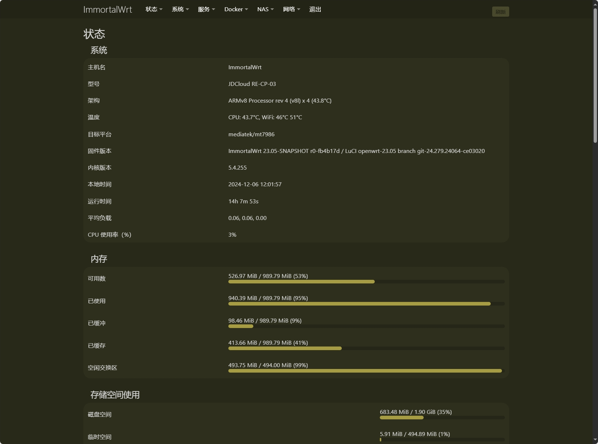
## BootstrapLightYellow
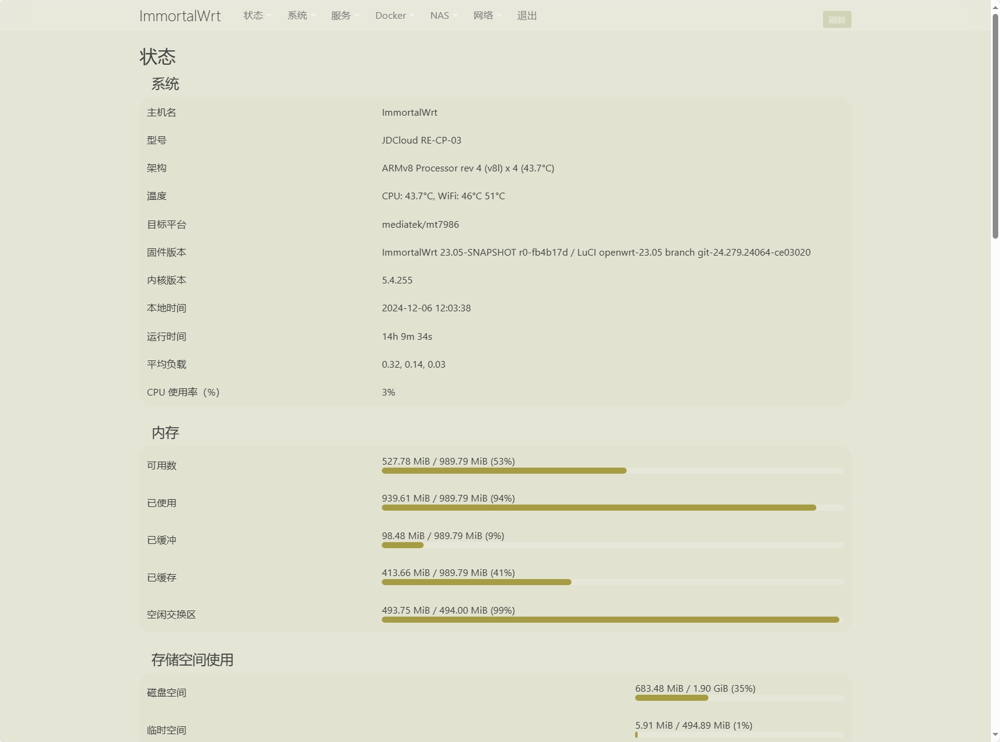
## BootstrapDarkOrange
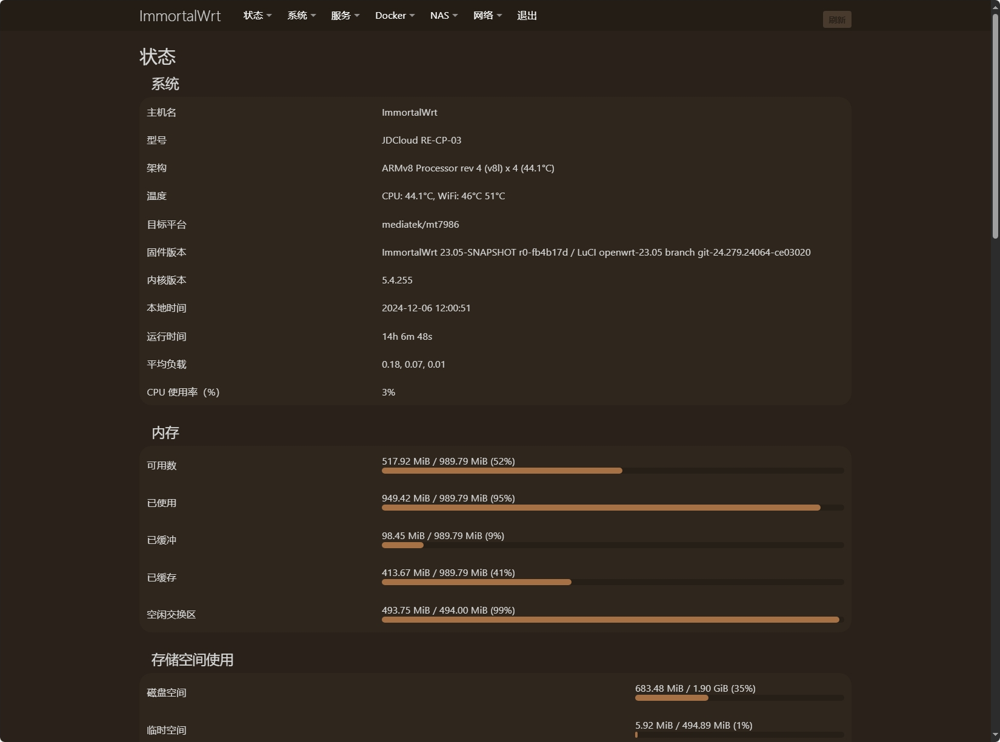
## BootstrapLightOrange
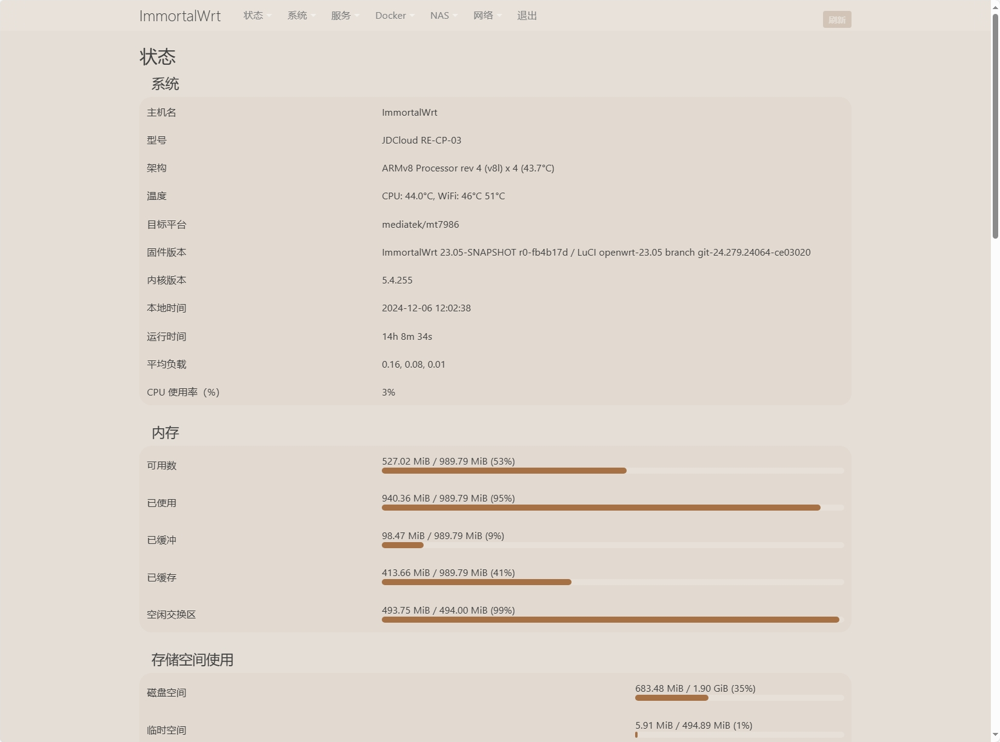
## BootstrapDarkPurple
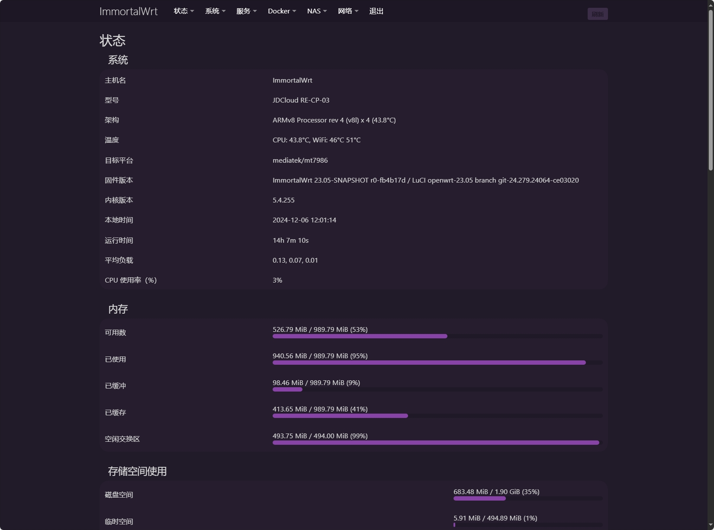
## BootstrapLightPurple
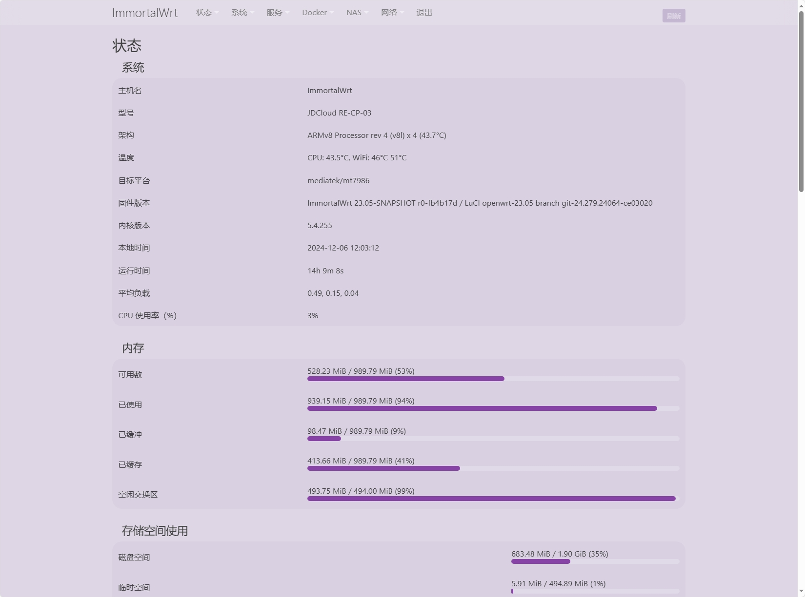